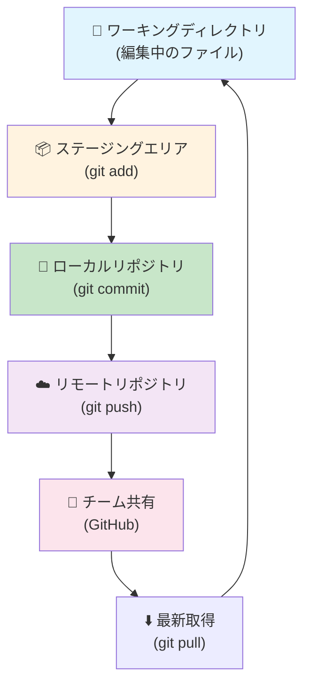
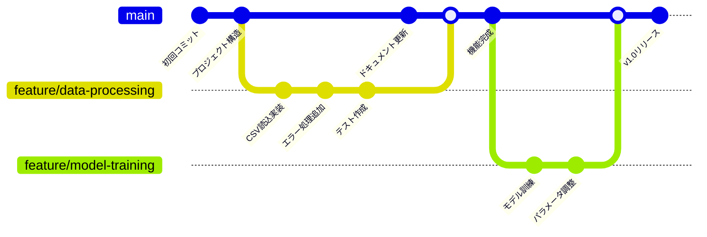
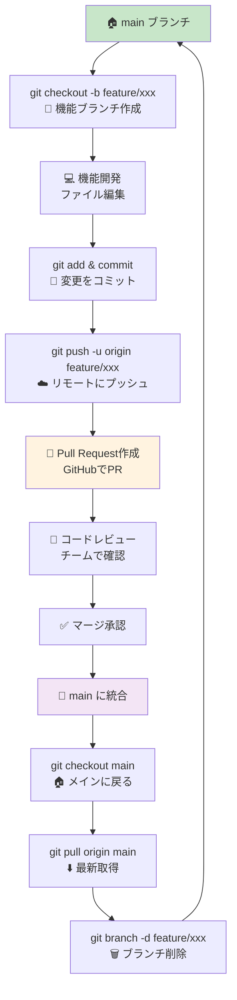

# Git & GitHub 開発ワークフロー学習ガイド

## 📋 目次
1. [基本概念](#基本概念)
2. [日常的な開発ワークフロー](#日常的な開発ワークフロー)
3. [ブランチを使った機能開発](#ブランチを使った機能開発)
4. [Pull Request ワークフロー](#pull-request-ワークフロー)
5. [よく使うコマンド一覧](#よく使うコマンド一覧)
6. [トラブルシューティング](#トラブルシューティング)

---

## 基本概念

### Git の三つの領域
```
ワーキングディレクトリ  →  ステージングエリア  →  ローカルリポジトリ  →  リモートリポジトリ
     (作業中)              (git add)           (git commit)        (git push)
```

### 🔄 Git ワークフローの図解



### 現在のプロジェクト構成
- **リポジトリ名**: `01tuning`
- **リモートURL**: `https://github.com/daisuke00001/01tuning.git`
- **メインブランチ**: `main`

---

## 日常的な開発ワークフロー

### 1. 現在の状態を確認
```powershell
# 現在のブランチと変更状況を確認
git status

# より詳細な差分を確認
git diff
```

### 2. 変更をステージング
```powershell
# 特定のファイルを追加
git add ファイル名

# 全ての変更を追加
git add .

# ステージングされた内容を確認
git status
```

### 3. 変更をコミット
```powershell
# コミットメッセージと共にコミット
git commit -m "適切なコミットメッセージ"

# より詳細なコミットメッセージ
git commit -m "機能: 新しいデータ処理関数を追加

- CSVファイルの読み込み機能を実装
- エラーハンドリングを追加
- テストケースを作成"
```

### 4. リモートリポジトリに反映
```powershell
# リモートにプッシュ
git push origin main
```

---

## ブランチを使った機能開発

### ブランチ戦略の図解



### 🔄 開発ワークフローの全体像



### 1. 新しい機能ブランチを作成
```powershell
# 新しいブランチを作成して切り替え
git checkout -b feature/データ処理改善

# または (Git 2.23以降)
git switch -c feature/データ処理改善

# ブランチ一覧を確認
git branch
```

### 2. 機能開発
```powershell
# ファイルを編集後
git add .
git commit -m "データ処理: CSVパーサーを改善"

# 複数のコミットを作成
git add src/data_processing.py
git commit -m "CSVファイルの読み込み速度を向上"

git add tests/test_data_processing.py
git commit -m "データ処理のテストケースを追加"
```

### 3. リモートブランチにプッシュ
```powershell
# 初回プッシュ（上流ブランチ設定）
git push -u origin feature/データ処理改善

# 以降のプッシュ
git push
```

---

## Pull Request ワークフロー

### 1. GitHub上でPull Request作成
1. GitHub リポジトリページにアクセス
2. "Compare & pull request" ボタンをクリック
3. 以下を記入：
   ```
   タイトル: データ処理機能の改善
   
   説明:
   ## 変更内容
   - CSVファイルの読み込み速度を50%向上
   - エラーハンドリングを強化
   - テストカバレッジを追加
   
   ## テスト内容
   - 大容量ファイルでの動作確認
   - エラーケースのテスト
   
   ## 関連Issue
   Closes #123
   ```

### 2. レビューと修正
```powershell
# レビューで指摘された内容を修正
git add .
git commit -m "レビュー修正: エラーメッセージを改善"
git push
```

### 3. マージ後の後処理
```powershell
# mainブランチに戻る
git checkout main

# 最新の変更を取得
git pull origin main

# 不要になったブランチを削除
git branch -d feature/データ処理改善

# リモートブランチも削除
git push origin --delete feature/データ処理改善
```

---

## よく使うコマンド一覧

### 📁 リポジトリ操作
```powershell
# 現在の状態確認
git status                    # 状態確認
git log --oneline            # コミット履歴（簡潔）
git log --graph --oneline    # ブランチも含めた履歴

# リモート確認
git remote -v                # リモートリポジトリ確認
git remote show origin       # リモートの詳細情報
```

### 🌿 ブランチ操作
```powershell
# ブランチ管理
git branch                   # ローカルブランチ一覧
git branch -r                # リモートブランチ一覧
git branch -a                # 全ブランチ一覧

# ブランチ切り替え
git checkout ブランチ名       # ブランチ切り替え
git switch ブランチ名         # ブランチ切り替え（新しい方法）

# ブランチ作成
git checkout -b 新ブランチ名  # 作成して切り替え
git switch -c 新ブランチ名    # 作成して切り替え（新しい方法）
```

### 🔄 同期操作
```powershell
# リモートから取得
git fetch                    # リモートの最新情報を取得
git pull                     # フェッチ + マージ
git pull origin main         # 明示的にmainブランチから取得

# リモートに送信
git push                     # 現在のブランチをプッシュ
git push origin ブランチ名    # 指定ブランチをプッシュ
git push -u origin ブランチ名 # 初回プッシュ（上流設定）
```

### 📝 コミット操作
```powershell
# ステージング
git add ファイル名            # 特定ファイル
git add .                    # 全ファイル
git add *.py                 # パターン指定

# コミット
git commit -m "メッセージ"    # コミット
git commit -am "メッセージ"   # 追加 + コミット（追跡済みファイルのみ）

# 直前のコミットを修正
git commit --amend -m "新しいメッセージ"
```

---

## トラブルシューティング

### ❌ よくあるエラーと解決方法

#### 1. プッシュが失敗する
```
error: failed to push some refs to 'origin'
```
**解決方法:**
```powershell
# リモートの変更を取得してからプッシュ
git pull origin main
git push origin main
```

#### 2. マージコンフリクト
```
CONFLICT (content): Merge conflict in ファイル名
```
**解決方法:**
```powershell
# 1. コンフリクトファイルを手動編集
# 2. 解決後にコミット
git add .
git commit -m "コンフリクト解決"
```

#### 3. 間違ったファイルをコミットした
```powershell
# 直前のコミットを取り消し（ファイルは残る）
git reset HEAD~1

# ファイルを修正してから再コミット
git add 正しいファイル
git commit -m "修正版のコミット"
```

#### 4. ブランチを間違えた
```powershell
# 現在のブランチを確認
git branch

# 正しいブランチに切り替え
git checkout 正しいブランチ名

# または変更を別ブランチに移動
git stash                    # 一時保存
git checkout 正しいブランチ名
git stash pop               # 変更を復元
```

---

## 🎯 実践練習課題

### 初級課題
1. **README.md を作成してプッシュ**
2. **設定ファイルを修正してコミット**
3. **新しいPythonファイルを追加**

### 中級課題
1. **機能ブランチでの開発**
2. **Pull Request の作成**
3. **コンフリクトの解決**

### 上級課題
1. **GitHub Actions の設定**
2. **リリースブランチの管理**
3. **タグを使ったバージョン管理**

---

## 📚 参考リンク

- [Git公式ドキュメント](https://git-scm.com/book/ja/v2)
- [GitHub Docs](https://docs.github.com/ja)
- [Learn Git Branching](https://learngitbranching.js.org/?locale=ja)
- [Git Cheat Sheet](https://training.github.com/downloads/ja/github-git-cheat-sheet/)

---

## 💡 ベストプラクティス

### コミットメッセージ
```
種類: 簡潔な説明

詳細な説明（必要に応じて）

関連Issue: #123
```

**種類の例:**
- `機能:` 新機能追加
- `修正:` バグ修正
- `改善:` 既存機能の改善
- `文書:` ドキュメント更新
- `テスト:` テスト追加・修正
- `リファクタ:` コードの整理

### ブランチ命名規則
```
feature/機能名       # 新機能
bugfix/問題名        # バグ修正
hotfix/緊急修正名    # 緊急修正
docs/文書名          # ドキュメント
```

### 定期的な作業
- 毎日の開始時: `git pull`
- 作業区切り: `git add` → `git commit`
- 1日の終わり: `git push`