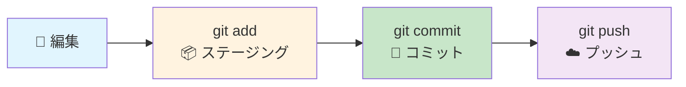

# Git クイックリファレンスカード 🚀

## 📊 基本操作の流れ



## 🎯 毎日使うコマンド

### 基本の流れ
```powershell
git status              # 状況確認
git add .               # 全変更をステージング
git commit -m "メッセージ"  # コミット
git push                # プッシュ
```

### 今日の作業開始
```powershell
git status              # 現在の状況
git pull origin main    # 最新取得
```

### 今日の作業終了
```powershell
git add .               # 変更をステージング
git commit -m "今日の作業内容"
git push                # プッシュ
```

---

## 🌿 ブランチ操作

### 新機能開発開始
```powershell
git checkout -b feature/機能名
# または
git switch -c feature/機能名
```

### ブランチ確認
```powershell
git branch              # ローカルブランチ一覧
git branch -r           # リモートブランチ一覧
```

### ブランチ切り替え
```powershell
git checkout main       # mainに切り替え
git switch feature/機能名  # 機能ブランチに切り替え
```

### 機能完成後
```powershell
git push -u origin feature/機能名  # 初回プッシュ
# GitHub上でPull Request作成
# マージ後
git checkout main
git pull origin main
git branch -d feature/機能名
```

---

## 🔍 状況確認

### 現在の状況
```powershell
git status              # 変更状況
git log --oneline       # コミット履歴
git log --graph --oneline  # ブランチ付き履歴
```

### 変更内容確認
```powershell
git diff                # 未ステージングの変更
git diff --staged       # ステージング済みの変更
git show                # 最新コミットの内容
```

---

## 🚨 トラブル対応

### 間違いを取り消し
```powershell
# ステージングを取り消し
git reset HEAD ファイル名

# 最後のコミットを取り消し（ファイルは残る）
git reset HEAD~1

# ファイルの変更を取り消し（危険！）
git checkout -- ファイル名
```

### コンフリクト解決
```powershell
git pull origin main    # コンフリクト発生
# ファイルを手動編集
git add .               # 解決後
git commit -m "コンフリクト解決"
```

### 一時的に変更を保存
```powershell
git stash               # 変更を一時保存
git stash pop           # 変更を復元
git stash list          # 保存リスト
```

---

## 📋 コミットメッセージテンプレート

### 基本形式
```
種類: 簡潔な説明（50文字以内）

詳細説明（必要に応じて）
- 変更した理由
- 何を変更したか
- 影響範囲

関連Issue: #123
```

### 種類の例
- `機能:` 新機能追加
- `修正:` バグ修正  
- `改善:` 既存機能の改善
- `文書:` ドキュメント更新
- `テスト:` テスト追加・修正
- `設定:` 設定ファイル変更

### 実例
```
機能: CSVファイル読み込み機能を追加

- pandas を使用したCSV読み込みを実装
- エラーハンドリングを追加
- メモリ効率を考慮した大容量ファイル対応

関連Issue: #45
```

---

## ⚡ よく使うショートカット

### エイリアス設定（一度だけ実行）
```powershell
git config --global alias.st status
git config --global alias.co checkout
git config --global alias.br branch
git config --global alias.ci commit
git config --global alias.unstage 'reset HEAD --'
```

### 設定後
```powershell
git st                  # git status
git co main             # git checkout main
git br                  # git branch
git ci -m "message"     # git commit -m "message"
```

---

## 🎯 現在のプロジェクト情報

- **リポジトリ**: `01tuning`
- **リモートURL**: `https://github.com/daisuke00001/01tuning.git`
- **メインブランチ**: `main`

### 現在のプロジェクトで試せること
1. **README.md作成**: `git checkout -b docs/readme`
2. **設定変更**: `git checkout -b config/update`
3. **新機能**: `git checkout -b feature/new-function`

---

## 💡 ワンポイントアドバイス

### 🟢 Good Practice
- 小さく頻繁にコミット
- 分かりやすいコミットメッセージ
- 作業前に `git pull`
- 1日の終わりに `git push`

### 🔴 避けるべきこと
- 大量の変更を一度にコミット
- 曖昧なコミットメッセージ
- mainブランチで直接開発
- 長期間プッシュしない

### 📱 緊急時の連絡先
- [Git公式ドキュメント](https://git-scm.com/book/ja/v2)
- [GitHub ヘルプ](https://docs.github.com/ja)
- [Stack Overflow](https://stackoverflow.com/questions/tagged/git)