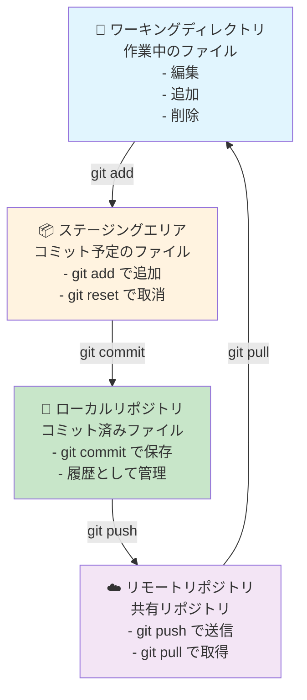
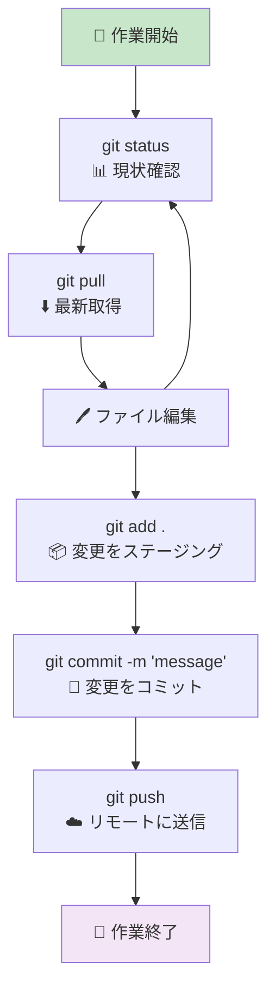
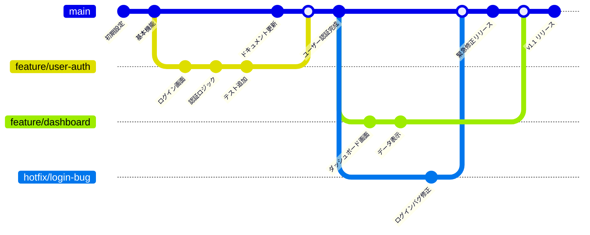
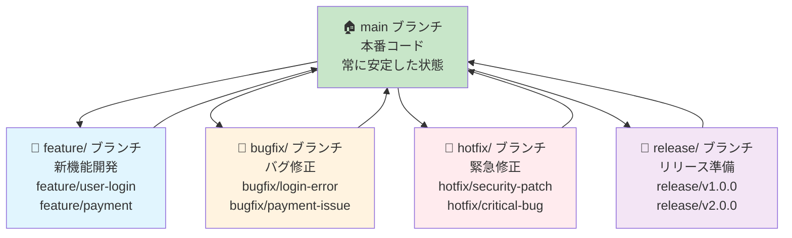
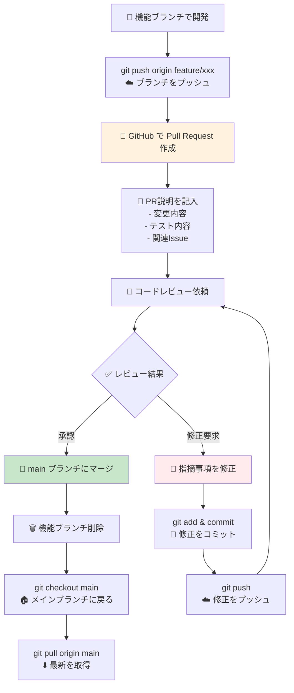
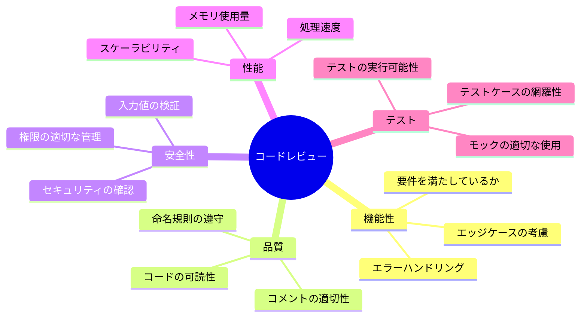
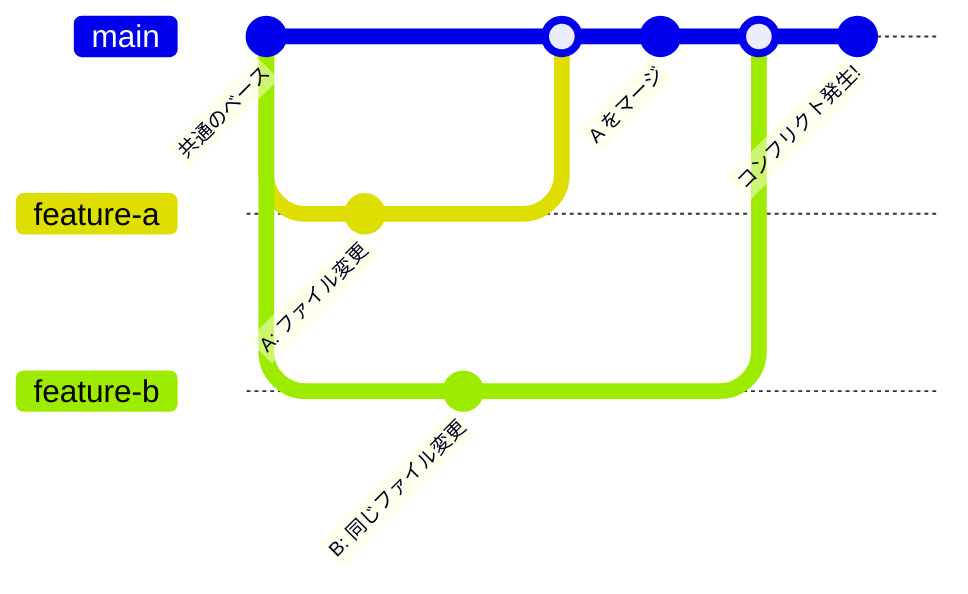
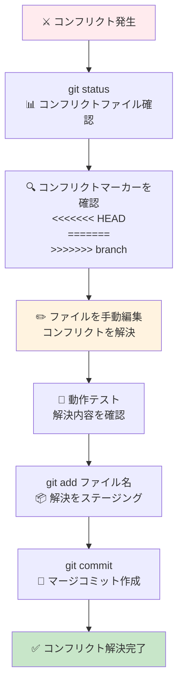
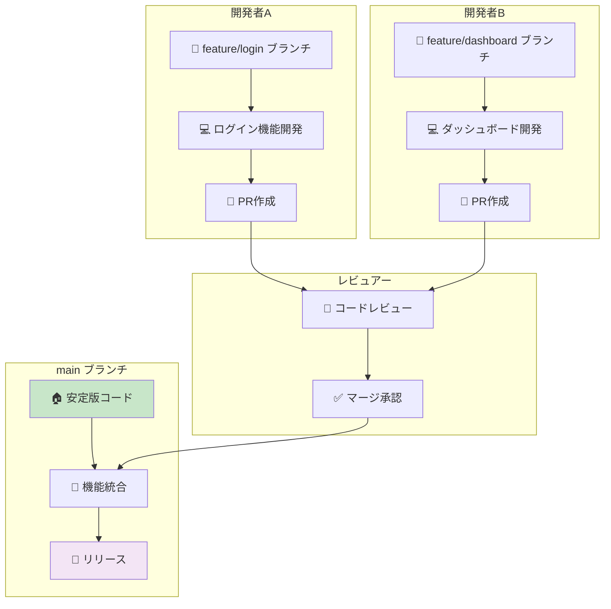
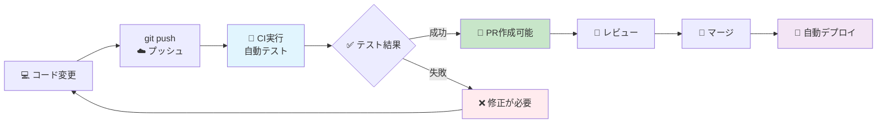

# Git & GitHub 視覚的図解ガイド 📊

このドキュメントは、Git/GitHubの操作を視覚的に理解するための図解集です。

## 📋 目次
1. [基本的なGitの流れ](#基本的なgitの流れ)
2. [ブランチ戦略](#ブランチ戦略)
3. [Pull Requestワークフロー](#pull-requestワークフロー)
4. [コンフリクト解決](#コンフリクト解決)
5. [チーム開発フロー](#チーム開発フロー)

---

## 基本的なGitの流れ

### 📁 Git の三つのエリア

### ⚡ 日常の作業サイクル

---

## ブランチ戦略

### 🌿 Feature Branch ワークフロー

### 🔄 ブランチの種類と用途

---

## Pull Requestワークフロー

### 🔄 PR作成から マージまで

### 📊 レビューのポイント

---

## コンフリクト解決

### ⚔️ マージコンフリクトの発生パターン

### 🔧 コンフリクト解決の手順

---

## チーム開発フロー

### 👥 複数人での開発フロー

### 🔄 継続的インテグレーション (CI/CD)

---

## 💡 図解の活用方法

### 📖 学習順序
1. **基本的なGitの流れ** を理解
2. **ブランチ戦略** でチーム開発を学習
3. **Pull Request** で協業方法を習得
4. **コンフリクト解決** でトラブル対応を練習
5. **チーム開発フロー** で実践的な開発を体験

### 🎯 実践のコツ
- 図解を見ながら実際にコマンドを実行
- 各段階でのファイル状態を確認
- エラーが発生したら図解で現在位置を把握
- チームメンバーと図解を共有して認識合わせ

### 📱 参考リンク
- [Git公式ドキュメント](https://git-scm.com/book/ja/v2)
- [GitHub Flow](https://guides.github.com/introduction/flow/)
- [Mermaid公式サイト](https://mermaid-js.github.io/mermaid/)

---

*この図解ガイドと合わせて、[Git学習ガイド](./git-github-workflow-guide.md) と [クイックリファレンス](./git-quick-reference.md) もご活用ください！*